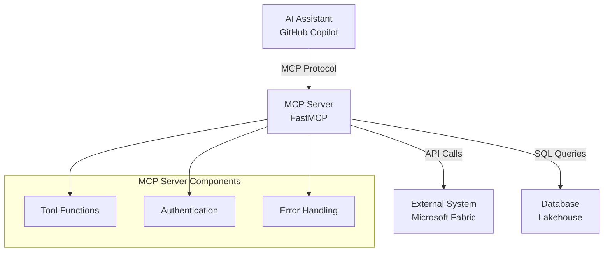

# Building an MCP Server with FastMCP

## Overview
Model Context Protocol (MCP) servers enable AI assistants to interact with external systems and data sources. FastMCP is a Python framework that simplifies building MCP servers.

## Architecture

## Quick Start

### 1. Installation & Setup
- Install FastMCP framework: `pip install fastmcp python-dotenv`
- Create `.env` file for sensitive configuration
- Initialize FastMCP server instance with descriptive name

### 2. Core Components

#### **Tool Functions**
- **Decorator**: Use `@mcp.tool()` to register functions
- **Docstrings**: Required - AI uses these to understand tool purpose
- **Type hints**: Specify parameter and return types for better integration
- **Return format**: Always return dictionaries for structured data
- **Error handling**: Wrap operations in try/catch, return user-friendly errors

#### **Authentication Pattern**
- **Environment variables**: Store CLIENT_ID, CLIENT_SECRET, TENANT_ID in .env
- **Token management**: Implement token acquisition and caching
- **Security**: Never hard-code credentials in source code

#### **Server Structure**
- **Import dependencies**: FastMCP, environment loading, external libraries
- **Initialize server**: Create FastMCP instance with meaningful name
- **Register tools**: Define async functions with @mcp.tool() decorator
- **Run server**: Use `mcp.run()` for startup

## Best Practices

### ✅ Do
- **Clear docstrings** - AI needs to understand your tools
- **Structured returns** - Use consistent dictionary formats
- **Error handling** - Always handle exceptions gracefully
- **Type hints** - Use proper Python type annotations
- **Environment variables** - Store secrets securely

### ❌ Don't
- **Hard-code secrets** - Use environment variables
- **Block async functions** - Use async/await properly
- **Return raw exceptions** - Convert to user-friendly messages
- **Skip documentation** - Docstrings are required for MCP

## Configuration & Testing

### VS Code Integration
- **MCP Configuration**: Create `.vscode/mcp.json` to register your server
- **Server registration**: Define command, arguments, and working directory
- **Python environment**: Use virtual environment path for isolation

### Testing Strategies
- **Unit testing**: Test individual tool functions with sample data
- **Integration testing**: Use VS Code + GitHub Copilot to test tool interactions
- **Error scenarios**: Verify graceful handling of invalid inputs and API failures
- **Tool syntax**: Test with `#tool_name` syntax in Copilot chat