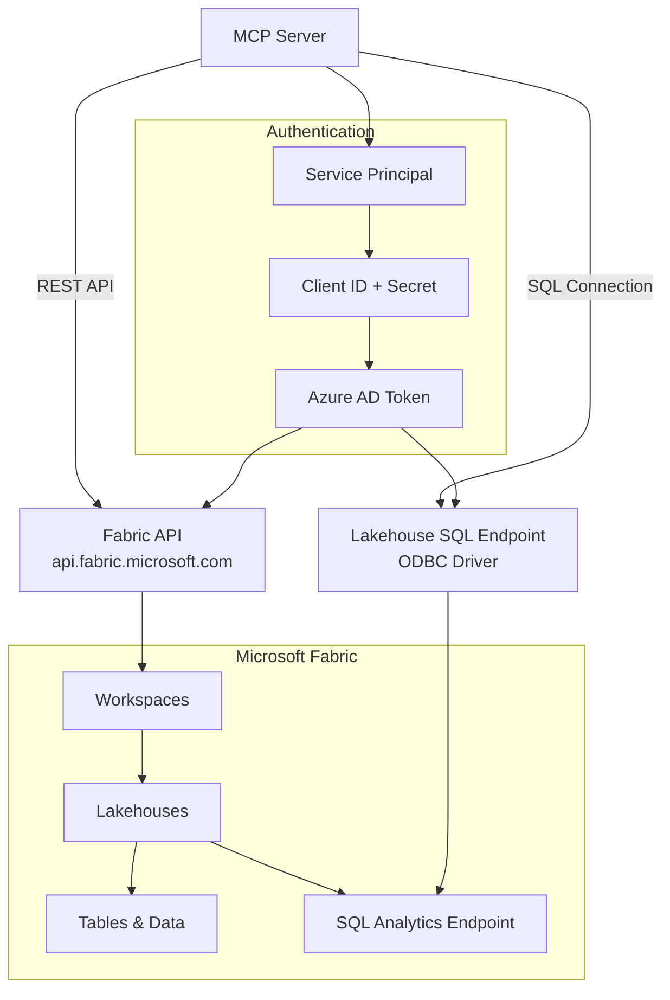

# Communicating with Microsoft Fabric from Python MCP Server

## Overview
Microsoft Fabric provides unified analytics platform with REST APIs and SQL endpoints. This guide shows how to integrate Fabric into your MCP server for data discovery and analytics.

## Architecture

## Authentication Setup

### Service Principal Configuration
- **Azure AD App Registration**: Create service principal with appropriate permissions
- **Power BI API Scope**: Use `https://analysis.windows.net/powerbi/api/.default` for Fabric access
- **Token Acquisition**: Use MSAL library with confidential client application
- **Environment Variables**: Store CLIENT_ID, CLIENT_SECRET, TENANT_ID securely
- **Authority URL**: Format as `https://login.microsoftonline.com/{TENANT_ID}`

### Key Authentication Points
- **Fabric Permission**: Service principal needs Power BI API access, not just Azure Resource Manager
- **Token Caching**: Cache tokens until expiry to avoid unnecessary requests
- **Error Handling**: Handle token acquisition failures gracefully
- **Scope Configuration**: Single scope `.default` is sufficient for most Fabric operations

## REST API Integration

### Centralized API Client Architecture
- **Base URL**: All Fabric APIs use `https://api.fabric.microsoft.com/v1` as base
- **Authentication Headers**: Include Bearer token in Authorization header for all requests
- **HTTP Client**: Use async HTTP library (httpx) for non-blocking operations
- **Response Handling**: Parse JSON responses and handle HTTP status codes appropriately
- **Error Management**: Convert HTTP errors into user-friendly error messages

### Common API Endpoints
- **Workspaces**: `/workspaces` - List all accessible workspaces
- **Lakehouses**: `/workspaces/{id}/lakehouses` - List lakehouses in workspace
- **Tables**: Access via SQL endpoint, not REST API
- **Items**: Generic `/workspaces/{id}/items` for broader resource discovery

### API Response Patterns
- **List Responses**: Most list endpoints return `{"value": [array_of_items]}`
- **Item Structure**: Items typically have `id`, `displayName`, and `properties`
- **Properties Object**: Contains service-specific metadata and connection info
- **Error Responses**: Include status code, error message, and request correlation ID

## SQL Endpoint Integration

### Connection Architecture
- **ODBC Driver**: Use "ODBC Driver 18 for SQL Server" for lakehouse connections
- **SQL Endpoint**: Extract from lakehouse properties via REST API call
- **Database Name**: Use lakehouse `displayName` as database name in connection
- **Authentication**: Service Principal authentication with UID/PWD parameters
- **Connection Security**: Enable encryption, disable certificate trust for managed service

### Schema Discovery Approach
- **INFORMATION_SCHEMA**: Query system views for table and column metadata
- **Simple Queries**: Avoid complex JOINs - use basic SELECT statements for reliability
- **Column Details**: Retrieve data types, nullability, precision, and ordinal position
- **Performance**: Query specific tables rather than entire schema when possible

### Data Sampling Strategy
- **TOP Clause**: Use `SELECT TOP N` syntax for consistent row limiting
- **Table Brackets**: Wrap table names in brackets to handle special characters
- **Result Formatting**: Convert query results to list of dictionaries for JSON serialization
- **Error Handling**: Catch and convert pyodbc errors to user-friendly messages

### SQL Analytics Capabilities
- **Custom Queries**: Allow execution of arbitrary SQL for analytics and reporting
- **Query Validation**: Validate SQL syntax before execution to prevent errors
- **Result Limiting**: Implement row limits to prevent excessive data transfer
- **Performance Monitoring**: Track query execution time and result set sizes

## Integration Workflow

### Progressive Discovery Pattern
1. **Workspaces**: Start by listing all accessible Fabric workspaces
2. **Lakehouses**: Discover lakehouses within selected workspace
3. **Tables**: Query lakehouse for available tables and views
4. **Schema**: Examine table structure and column definitions
5. **Data**: Sample table content and execute analytics queries

## Key Dependencies
- **Authentication**: `msal` for Azure AD token acquisition
- **HTTP Client**: `httpx` for async REST API calls
- **Database**: `pyodbc` with ODBC Driver 18 for SQL Server
- **Environment**: `python-dotenv` for configuration management
